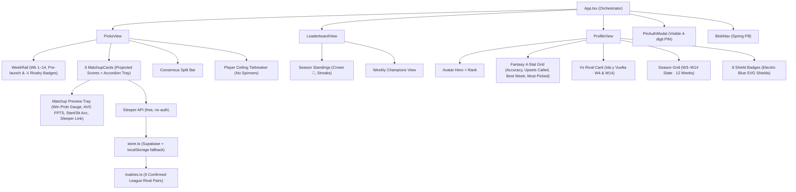

# Last Chance Fantasy Pick'em — Full Runbook
*Custom Weekly Matchup Pick'em for Sleeper League `1390903684027670528`*
*Inspired by the design and architecture of [The Set Pick 'Em](https://thesetpickem.com)*

---

## 1. League Reference

| Field | Value |
|---|---|
| **League ID** | `1390903684027670528` |
| **Season** | `2026` (Regular Season) |
| **Current Week** | Week 3 (Open — games not yet started) |
| **Project Root** | `/home/saul/projects/last-chance-pickem` |
| **Dev Server** | `http://localhost:5173` |

### 12 Managers

| Roster | Manager | Team Name | Record |
|:---:|:---|:---|:---:|
| #1 | `Varguitas8` | C. McCarrying MyTeam | 1-1 |
| #2 | `carrizales04` | Daejon Love's Team | 0-2 |
| #3 | `xXExoRequiemXx` | Fear The Doro | 1-1 |
| #4 | `lsemilio05` | CEEDEE'S NUTS | 2-0 |
| #5 | `DanielCasta` | Jerry's Last Ring | 2-0 |
| #6 | `Eltacho21` | Help me step burrow | 0-2 |
| #7 | `germizzz` | Shotgun Germizz | 1-1 |
| #8 | `JLU18` | JLU18's Team | 1-1 |
| #9 | `Diegocr21` | The Maye-Trix | 2-0 |
| #10 | `saul6` | ene efe ele | 0-2 |
| #11 | `EmilioLozano` | Amon drugs | 1-1 |
| #12 | `Curi07` | Curi07's Team | 1-1 |

---

## 2. Rules & Mechanics

1. **Lock Deadline**: All 6 picks lock at **Thursday Night Kickoff — 8:15 PM ET** (enforced by comparing `Date.now()` vs the week's Thursday UTC timestamp).
2. **Tiebreaker**: Guess the **single highest fantasy points scored by any player** in the league that week (starters or bench). Resolved from `max(players_points)`.
3. **Self-Matchups**: Allowed.
4. **Auth**: Select team from grid → enter a 4-digit PIN. First login creates it; subsequent logins verify it. Session in `localStorage`.
5. **Team Name Resilience**: Everything keyed on immutable Sleeper `user_id` / `roster_id`. Name/avatar changes auto-sync on page load.

---

## 3. App Architecture



**Tech Stack**: React 19 + TypeScript + Vite 8 + Tailwind v4 + Lucide + Canvas Confetti + Supabase JS

---

## 4. Implementation Status ✅ (Deployment-Ready)

`pnpm build` → **0 TypeScript errors · 295 kB JS · ~510ms**  
`pnpm sync`  → **Live Sleeper data · 12 managers · 6 matchups**

| File | Status | Notes |
|:---|:---:|:---|
| `src/index.css` | ✅ | Tailwind v4, OLED palette, global dark scrollbars, number spinner removal |
| `src/types/index.ts` | ✅ | Shared types, fantasy analytics, rival records, badges, projected scores |
| `src/lib/rivalries.ts` | ✅ | 6 confirmed rivalry pairs (W4 & W14), `LAUNCH_WEEK = 3`, `SEASON_LAST_WEEK = 14` |
| `src/lib/sleeper.ts` | ✅ | Thursday kickoffs, live roster stats (`avgPoints`, `startSitAccuracy`, `winProb`) |
| `src/lib/store.ts` | ✅ | Supabase + localStorage dual-mode, per-user profile stats with rival tracking |
| `src/components/BlobNav.tsx` | ✅ | Button refs, rAF measurement, zero flash |
| `src/components/WeekRail.tsx` | ✅ | Scroll-into-view pill, pre-launch `—` badges, `⚔️` rivalry indicators |
| `src/components/MatchupCard.tsx` | ✅ | Projected team scores, win probability bar, inline accordion tray, Sleeper link |
| `src/components/PicksView.tsx` | ✅ | Pre-launch banner for W1/W2, tiebreaker input with no spinners, lock-aware |
| `src/components/LeaderboardView.tsx` | ✅ | Skeleton loaders, live Sleeper names/avatars |
| `src/components/ProfileView.tsx` | ✅ | Hero, fantasy stat tiles, Vs Rival card, W3–W14 season grid, 8 SVG badges |
| `src/components/PinAuthModal.tsx` | ✅ | Visible numeric digits (`1 2 3 4`), reset on reopen, click-outside |
| `src/components/Header.tsx` | ✅ | Sticky top bar, user chip |
| `src/App.tsx` | ✅ | usersLoading state, profile CTA for anon users, rival resolution |
| `src/supabase_schema.sql` | ✅ | No FK picks→games, `score_week_picks()`, `leaderboard` view, indexes |
| `scripts/sync-sleeper.ts` | ✅ | Real kickoffs, typed, auto-scores picks when week is final |
| `index.html` | ✅ | PWA meta, OG tags, Apple mobile capable, theme-color |
| `public/favicon.svg` | ✅ | Custom football icon (not Vite default) |
| `public/_redirects` | ✅ | Cloudflare Pages SPA routing |
| `public/_headers` | ✅ | Cache-Control + security headers |
| `.env.example` | ✅ | Template for Supabase credentials |

---

## 5. Phase 1 — Local Testing (No Supabase)

Everything works out of the box. Data saves to `localStorage`.

```bash
cd ~/projects/last-chance-pickem

# Install dependencies (first time only)
pnpm install

# Start the dev server
pnpm dev
# → Open http://localhost:5173 in your browser

# Fetch live Sleeper data (matchups + tiebreaker ceiling)
pnpm sync

# Type-check only (no build output)
pnpm exec tsc --noEmit

# Full production build
pnpm build

# Preview the production build locally
pnpm preview
# → Open http://localhost:4173
```

### Local Test Checklist

- [ ] **Picks tab loads** — real team names/avatars from Sleeper, 6 matchup cards visible
- [ ] **Pick a team** — card glows blue, checkmark, counter updates (`3 / 6`)
- [ ] **Save Picks** — confetti fires, blue success toast
- [ ] **Week 1 / 2** — `Final` status, real fantasy scores, cards disabled
- [ ] **Tiebreaker** — enter `38.5` → saves with picks
- [ ] **Claim Team** — select manager → 4-digit PIN → signed in; refresh → still signed in
- [ ] **Wrong PIN** — error shown, no sign-in
- [ ] **Leaderboard** — 12 managers with streaks → click row → opens profile
- [ ] **Profile (signed in)** — correct user's stats, weekly W/L history
- [ ] **Profile (anon)** — shows "Claim Team" CTA, not a blank screen
- [ ] **Sign out** — returns to unauthenticated state

> Picks only exist per-device until Supabase is connected.

---

## 6. Phase 2 — Supabase Setup (Cross-Device Sync)

### Step 1: Create a Project

1. [supabase.com](https://supabase.com) → **New Project**
2. Name: `last-chance-pickem`, choose a DB password, pick a region
3. Wait ~2 minutes

### Step 2: Run the Schema

1. Dashboard → **SQL Editor** → **New Query**
2. Paste the full contents of `src/supabase_schema.sql`
3. Click **Run** → should complete with no errors

Creates:
- **`profiles`** — manager cache (hydrated from Sleeper)
- **`games`** — matchup rows upserted by sync CLI
- **`picks`** — one row per `(user_id, game_id)`, no FK dependency on games
- **`tiebreakers`** — manager guesses
- **`game_splits()`** — RPC returning pick % per matchup
- **`score_week_picks()`** — marks `is_correct` after a week goes final
- **`leaderboard`** — view computing season W/L from real picks

### Step 3: Get Credentials

Dashboard → **Project Settings** → **API**:
- **Project URL** (e.g. `https://abcxyz.supabase.co`)
- **anon / public key** (starts with `eyJ...`)

### Step 4: Create `.env.local`

```bash
cd ~/projects/last-chance-pickem
cp .env.example .env.local
nano .env.local
```

```env
VITE_SUPABASE_URL=https://your-project-id.supabase.co
VITE_SUPABASE_ANON_KEY=eyJhbGciOiJIUzI1NiIsInR5cCI6IkpXVCJ9...
```

### Step 5: Test with Supabase

```bash
# Restart dev server to pick up new env vars
pnpm dev
```

Repeat the Phase 1 checklist. After saving picks, verify in:  
**Dashboard → Table Editor → `picks`** — rows appear.

### Step 6: Sync CLI with Supabase

```bash
# With .env.local set, this also upserts game rows to the DB
pnpm sync
```

Run this **every Thursday evening after kickoff** to update scores. When a week ends, it automatically calls `score_week_picks()` to mark correct/incorrect on all picks.

---

## 7. Phase 3 — Deploy (Free Tier, League-Wide)

### Option A: Cloudflare Pages ⭐ (Recommended)

Free tier: unlimited bandwidth & requests, 500 builds/month, custom domain.

#### Git Deploy (auto-deploys on every push)

```bash
# 1. Push to GitHub
cd ~/projects/last-chance-pickem
git remote add origin https://github.com/YOUR_USERNAME/last-chance-pickem.git
git push -u origin master
```

Then in Cloudflare:
1. [dash.cloudflare.com](https://dash.cloudflare.com) → **Workers & Pages** → **Create** → **Pages** → **Connect to Git**
2. Select your repo
3. Settings:
   - **Framework preset**: Vite
   - **Build command**: `pnpm build`
   - **Build output directory**: `dist`
4. **Environment Variables** → Add both Supabase vars
5. **Save and Deploy** → ~30 seconds → live at `https://last-chance-pickem.pages.dev`

Every `git push master` auto-deploys. `_redirects` and `_headers` in `public/` are automatically applied.

#### CLI Deploy (no GitHub needed)

```bash
npm install -g wrangler
wrangler login
pnpm build
wrangler pages deploy dist --project-name last-chance-pickem
```

---

### Option B: Vercel

Free tier: 100 GB bandwidth/month.

```bash
npm install -g vercel
cd ~/projects/last-chance-pickem
vercel
# Vite preset, build: pnpm build, output: dist

vercel env add VITE_SUPABASE_URL
vercel env add VITE_SUPABASE_ANON_KEY
vercel --prod
```

Or via [vercel.com/new](https://vercel.com/new) → import GitHub repo.

---

### Option C: Netlify

Free tier: 100 GB bandwidth, 300 build minutes/month.

```bash
npm install -g netlify-cli
cd ~/projects/last-chance-pickem
pnpm build
netlify deploy --dir=dist --prod
```

Add env vars: **Site Settings → Environment Variables** in Netlify dashboard.

---

### After Deploying — Share With the League

Send the URL in your group chat. Each manager:
1. Opens the link on their phone
2. Taps **Claim Team** in the header
3. Picks their name from the grid
4. Sets a 4-digit PIN
5. Done — picks on any device going forward

> On iOS: tap the Share icon → **Add to Home Screen** → the app installs as a PWA with the football icon and no browser chrome.

---

## 8. Weekly Workflow (Every Thursday)

```bash
# Check current matchups and tiebreaker answer
pnpm sync

# (After the week ends) Run again — auto-scores all picks in Supabase
pnpm sync
```

That's it. The leaderboard and profile stats update automatically once picks are scored.

---

## 9. What Becomes Real After Supabase

| Feature | Without Supabase | With Supabase |
|:---|:---|:---|
| **Leaderboard records** | Placeholder seed data | Real W/L from picks vs Sleeper winner |
| **Profile weekly history** | Placeholder per-user data | Actual per-week correct/total from DB |
| **League consensus splits** | Deterministic simulation | Real % of each team picked across 12 managers |
| **Multi-device picks** | `localStorage` per device | Synced across all devices |

---

## 10. Season Maintenance

Update **two places** at the start of each new NFL season:

**`src/lib/sleeper.ts`** → `getThursdayKickoff()`:
```ts
// Week 1 Thursday of the new season at 8:15 PM ET (= 00:15 UTC next day)
const WEEK1_THURSDAY_UTC = new Date('2026-09-11T00:15:00Z');
//                                   ^^^^ bump each year
```

**`scripts/sync-sleeper.ts`** → same constant at the top:
```ts
const WEEK1_THURSDAY_UTC = new Date('2026-09-11T00:15:00Z');
```

**`src/lib/store.ts`** → tiebreaker upsert:
```ts
season: '2026',  // ← bump each year
```
